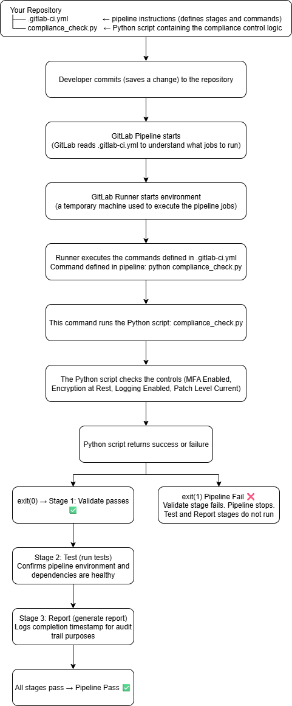
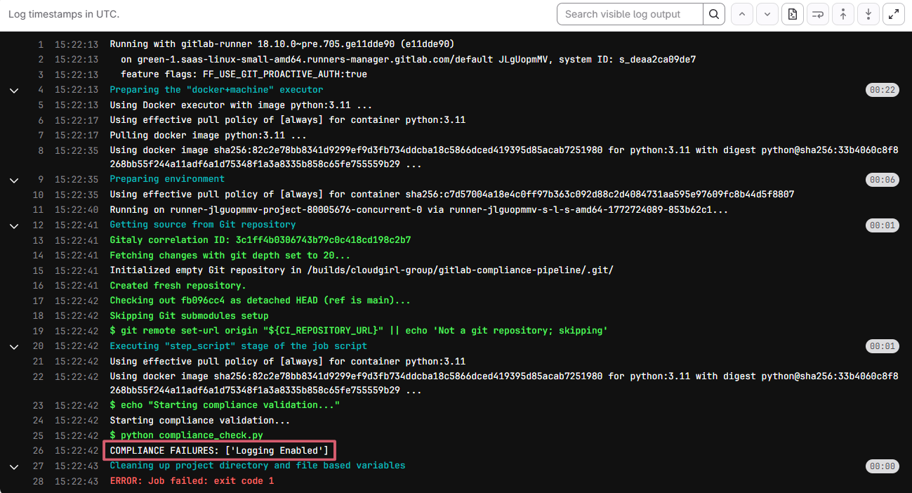
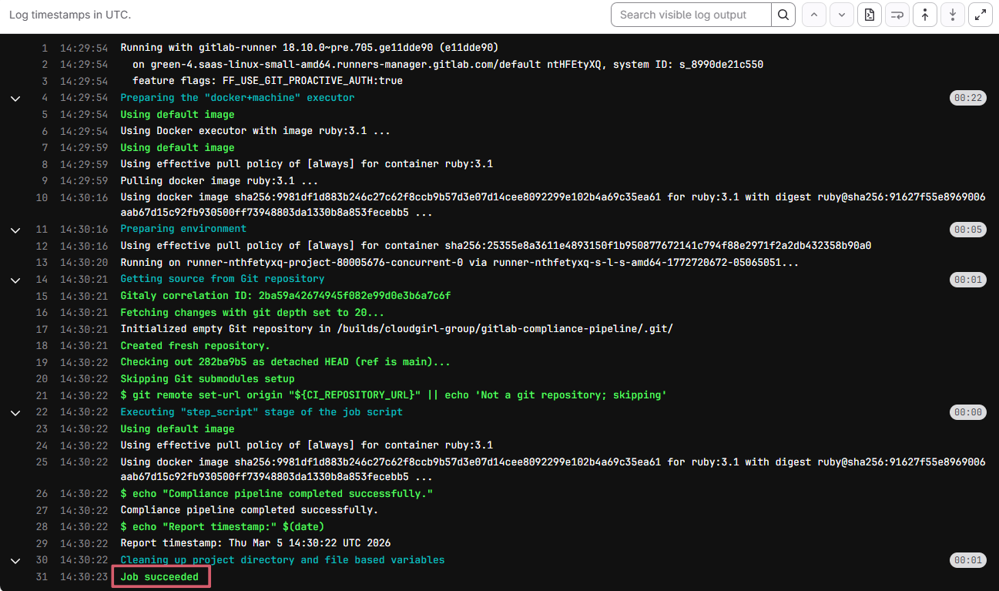

# GitLab Compliance Pipeline

A GitLab CI/CD pipeline that simulates automated compliance control validation, bridging DevSecOps pipeline concepts with GRC principles.

---

## Purpose

Demonstrates how CI/CD pipelines can enforce compliance controls automatically on every code commit, reducing manual audit effort and improving control consistency.

---

## GitLab CI/CD Execution Flow

---

## Pipeline Stages
| Stage | Job | Description |
|---|---|---|
| Validate | validate-controls | Runs compliance_check.py and fails the pipeline if any control is non-compliant |
| Test | run-tests | Confirms pipeline environment and dependencies are healthy |
| Report | generate-report | Logs completion timestamp for audit trail purposes |

---

## GRC/Compliance Alignment
| Pipeline Behavior | GRC Concept |
|---|---|
| Pipeline fails on control failure | Preventive control and blocks deployment until remediated |
| Every commit triggers a check | Continuous monitoring vs. point-in-time audits |
| Pass/fail logged per run | Audit trail and evidence collection |
| Controls defined in code | Policy-as-code / control codification |

---

## How It Works
`compliance_check.py` evaluates a set of boolean controls:
- MFA Enabled
- Encryption at Rest
- Logging Enabled
- Patch Level Current

> If any control is `False`, the pipeline exits with code 1 (failed).

> If all controls are `True`, the pipeline passes.

---

## Tools Used
- GitLab CI/CD
- Python 3.11
- GitLab SaaS Runners

---

## Screenshots
### Pipeline Failure (control non-compliant)

### Pipeline Pass (all controls compliant)

---

## How to Replicate this Project

Steps to Replicate This Project

### Prerequisites
- A free GitLab account (sign up at gitlab.com)
- Basic familiarity with Python (helpful but not required)

### Step 1 - Create your GitLab project
1. Go to [gitlab.com](https://gitlab.com) and sign in
2. Click the **"+"** icon in the top navigation bar
3. Select **"New project/repository"**
4. Click **"Create blank project"**
5. Enter your project name (e.g. `gitlab-compliance-pipeline`)
6. Set visibility to **Public**
7. Check **"Initialize repository with a README"**
8. Click **"Create project"**

### Step 2 - Open the Web IDE
1. On your project main page, click on **README.md**
2. Click the blue **"Edit"** button in the top right
3. Select **"Open in Web IDE"**

### Step 3 - Add the compliance check script
1. In the Web IDE, right-click in the file explorer on the left
2. Select **"New file"**
3. Name it `compliance_check.py`
4. Paste the code from [compliance_check.py](./compliance_check.py)
5. Click **"Commit"** → commit to **main**

### Step 4 - Add the pipeline file
1. Right-click in the file explorer again
2. Select **"New file"**
3. Name it exactly `.gitlab-ci.yml` (the dot at the front matters!)
4. Paste the code from [.gitlab-ci.yml](./.gitlab-ci.yml)
5. Click **"Commit"** → commit to **main**

### Step 5 - Watch the pipeline run
1. In the left sidebar, click **"Build"** → **"Pipelines"**
2. You should see a pipeline triggered automatically
3. Click into it to watch each stage run
4. ⚠️ It will **fail on first run** - this is expected! The pipeline detects that `Logging Enabled` is set to `False`

### Step 6 - Remediate and rerun
1. Open `compliance_check.py`
2. Change `"Logging Enabled": False` to `"Logging Enabled": True`
3. Commit to **main**
4. Watch the pipeline rerun - all 3 stages should go green ✅

---
